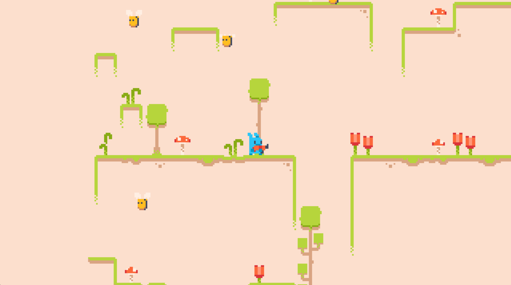
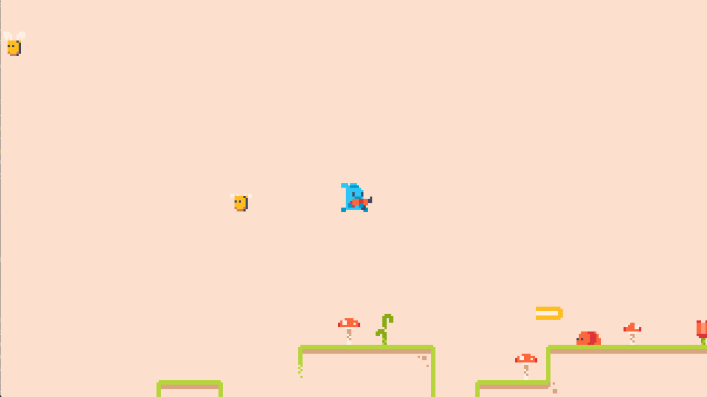
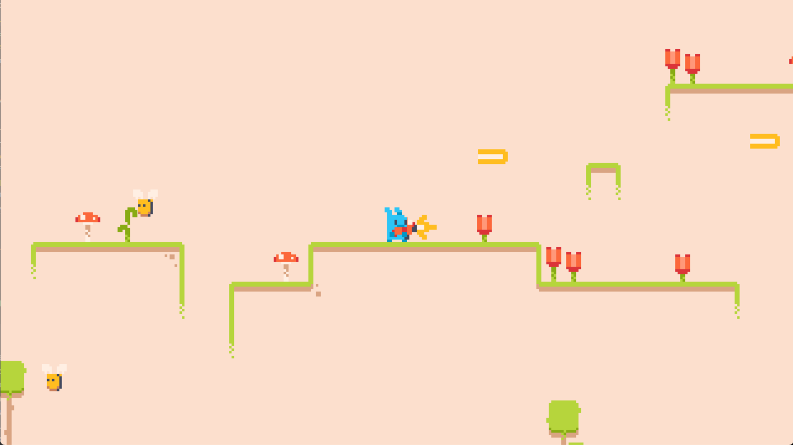

Retro Platformer

A classic-style 2D platformer built with Pygame
Features

    Side-scrolling platformer gameplay

    Player movement with running and jumping

    Shooting mechanics with muzzle flash effects

    Enemy types: Flying Bees and Crawling Worms

Screenshots
 

Controls
Key	Action
← / →	Move left/right
Space	Jump
S	Shoot
Installation

    Clone the repository:

bash

git clone https://github.com/yourusername/retro-platformer.git
cd retro-platformer

    Install dependencies:

bash

pip install pygame pytmx

    Run the game:

bash

python main.py

Project Structure
text

├── main.py          # Game loop and main logic
├── settings.py      # Configuration constants
├── sprites.py       # All game sprite classes
├── groups.py        # Sprite groups with camera logic
├── support.py       # Asset loading utilities
├── timer.py         # Timer class for cooldowns
├── data/            # Maps (TMX files)
├── images/          # Sprite assets
├── audio/           # Sound effects and music
└── screenshots/     # Gameplay screenshots

Enemy Behavior

    Bee: Flies in a sine wave pattern from right to left

    Worm: Crawls along platforms and reverses direction at edges

Asset Credits

All assets (sprites, sound effects, music) are from [insert credit source here]
License

MIT
